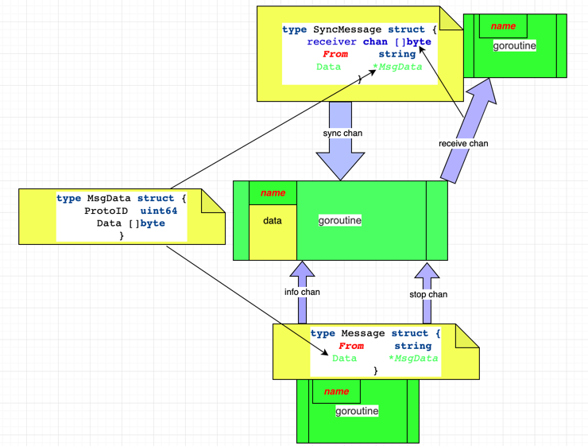
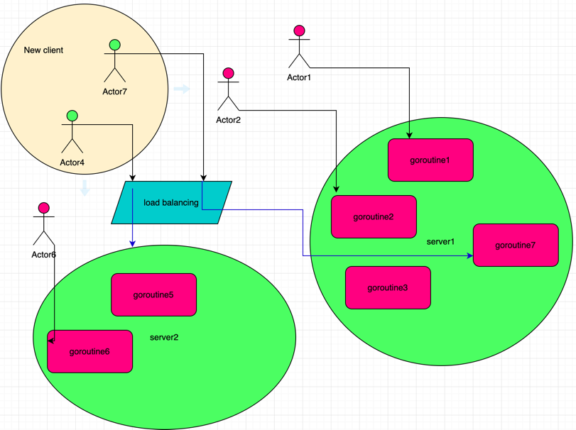
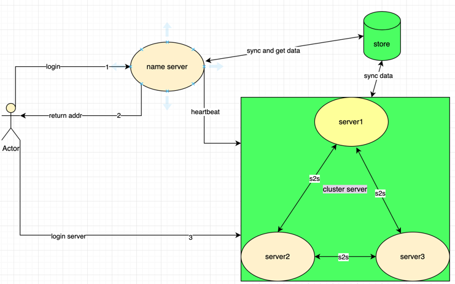
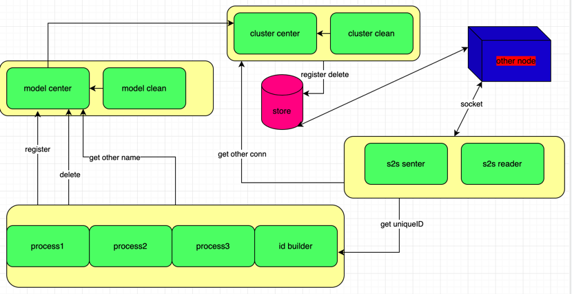
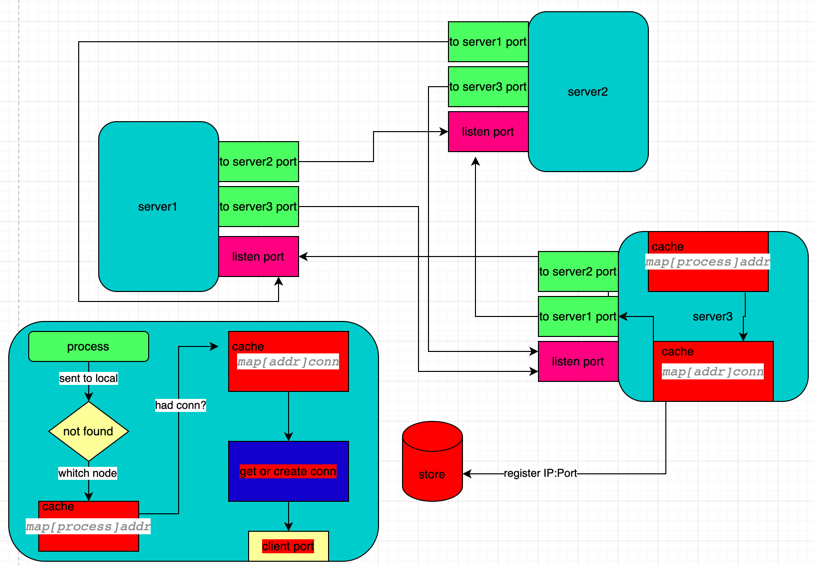
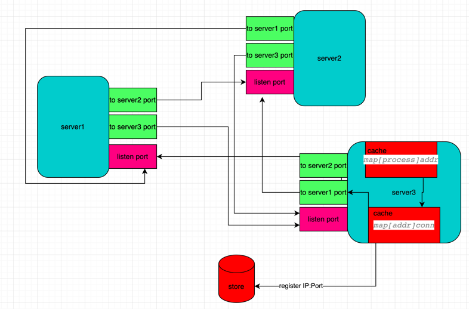
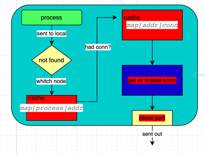

# behavior

**go**、 **behavior**、 **erlang**、**goroutine**、**actor**、**process**

[TOC]

### 简述

这是一个适用于长链接、有状态的高并发的微服务架构。适用于电信、游戏、IM、数据流等。

使用过erlang的同学，会很容易理解，用go实现erlang思想，actor模型。面向process编程。
没有使用过erlang的同学，慢慢看。

### 面向process编程

和面向对象编程有些类似，需要抽象事物。面向process编程，是把事物抽象成goroutine，
不是抽象成struct（当然，完全可以继续使用 面向对象思维编写业务逻辑，毫无影响）。见下图：


上图的goroutine就是一个process，有自己的数据data、name，和3个接收消息的chan：

- info chan 接收异步消息，message包含协议ID和消息内容
- stop chan 接收stop消息，message包含stop的协议ID，消息内容为空
- sync chan 接收同步数据消息，messgae中还包含receive chan，返回给发送者数据结果

发送者需要发送自己的name（message中的from）

### 有什么用（面向对象人员的疑问）

#### 异步编程思维

- 每个process只需要完成自己任务
- 崩溃不影响其他process
- process间通过消息驱动

#### 粒度最细的微服务

每个process都可以作为一个服务，轻松跨节点调用

#### 上手容易
```go
import (
"github.com/GuanghuiLiu/behavior/model"
)
type test struct {
   model.QuickHandel
}
func main()  {
    t := &test{}
    t.Name = "t1"
    t.Run(t)
}
```
这样一个process就启动起来了。当然，想要更完善、功能更全面，我们再加自己想法和业务逻辑。

#### 高并发

这个就不用解释了吧，基本单位就是goroutine

#### 7+4负载均衡



如上图，新接入的客户端：如果该用户的process还存活，该用户将连接到存活用户的节点，类似断线重联（actor7）；如果没有该用户的process存活，该用户将根据各个节点的可容纳goroutine数量，动态平衡权重，连接到空闲节点（actor4）。

#### 容错性

即使有部分程序出错，系统也可以继续运行

#### 等😆

### 系统介绍

#### 整体


客户端从name server获取服务器地址，登录到对应服务器；服务器之间通过s2s通信；server将节点信息、goroutine信息同步到store，name server从store获取服务器信息，并根据连接状态更新服务器信息

#### Local server


图中绿色实体，是goroutine。

- **process1、process2**….和**id builder**是标准process：id builder是服务器自建process，用来生成自增ID，为s2s同步消息、socket命名提供唯一ID；其他process是用户自建process
- **model center**用来注册、删除、查询当前节点的process，以process名字作为key，实例指针作为value的map；**model clean**用来定时重置process的过期时间，按照当前节点的process个数匹配制定策略，达到清理process的目的
- **cluster center**将本地process和当前节点信息同步到云端store，为s2s和name server提供数据源，同时，本地也存储了云端数据，方便本地使用（s2s）；**cluster clean** 定时拉取云端节点信息，发送其他节点心跳，当发现有节点宕机，清理云端数据和本地的云端数据
- **s2s**是跨节点不同process收发消息。**s2s reader**是tcp socket的服务端，长链接，只需要一个端口，一个process，以供各个节点发送消息；**s2s senter**是socket客户端，维护不同节点的链接（包含本地缓存连接），同时，接收其他节点的返回数据，用以收取sync请求，此时，需要唯一ID，区分不同请求

#### s2s



##### 端口、连接示意图：



- 每个服务器节点都有一个监听端口，接收其他节点发送给本地processes的消息；
- 每个服务器节点都有多个连接其他节点的客户端端口，通过客户端端口发送请求到相应节点，供本地processes发送给不同远端请求

##### 请求过程



每个节点都缓存连接，不必每次远端请求都去寻找地址、创建连接。
每当请求失败都会清理、cluster clean也会定时清理


#### name server
#### common server
##### gateway
auth认证，由长链接完成，一次验证，终身（长链接）有效

#### tcp/udp
### 玩法
### 建议
- process间协议自定义：每个key，对应一种数据类型，自己实现协议，可快速解析。
- process间，简单字段传输，使用json；与client端，或者大协议，使用protobuf
- 在跨语言、跨节点交互中，用固定ProtoID方便协调，不用自增ID(iota)
- 传输数据尽量小。小传输，大计算场景
### todo
- 增加监控进程，以便同步stop、向自己发消息等同步操作

- version 动态更新process

- CONFIG、LOG
